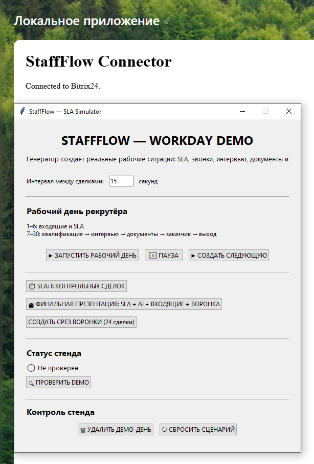

# Bitrix24 Demo Stand



**Демо-стенд для презентаций решений на базе Bitrix24.**  
Автоматически подготавливает CRM под нужный сценарий: создаёт лиды и сделки, заполняет необходимые поля и переводит записи по этапам воронки.

## Зачем нужен

Когда нужно показать заказчику или работодателю, как работает решение в Bitrix24, нет смысла каждый раз вручную создавать тестовые данные и настраивать портал под нужный сценарий.

Демо-стенд делает это автоматически.

Задаём сценарий — получаем готовую CRM, на которой можно сразу проводить презентацию.

Основной сценарий проекта — автоматизация работы кадрового агентства:

**Входящий кандидат → AI-квалификация → SLA → работа рекрутера → результат.**

Это именно **инструмент для демонстраций**, а не полноценная HR-система.

## Что умеет

Демо-стенд может:

- подготовить CRM под демонстрационный сценарий;
- создать тестовых кандидатов, лиды и сделки;
- заполнить необходимые CRM-поля;
- разместить записи на нужных этапах воронки;
- сформировать повторяемый сценарий для презентации;
- подготовить демо-состояния, связанные с SLA;
- запустить сценарий входящего кандидата;
- восстановить или очистить демо-данные.

### AI-квалификация

В сценарии кадрового агентства входящее сообщение кандидата проходит через коннектор.

GigaChat анализирует текст и определяет, на какую должность претендует кандидат.

После этого Bitrix24 создаёт или обновляет соответствующую сделку в CRM.

При этом данные SLA, приоритета и срочности остаются под управлением CRM-процесса и не перезаписываются AI-квалификацией.

## Как устроено

```
                 Демо-сценарий
                      │
                      ▼
             ┌─────────────────┐
             │   Симулятор     │
             │     сценария    │
             └────────┬────────┘
                      │
                      │ HTTP / REST
                      ▼
             ┌─────────────────┐
             │    Connector    │
             └────────┬────────┘
                      │
                      │ Bitrix24 REST API
                      │ Открытые линии
                      ▼
             ┌─────────────────┐
             │     Bitrix24    │
             │ CRM + Открытые  │
             │ линии           │
             └─────────────────┘
                      ▲
                      │
                  GigaChat
               AI-квалификация
```

## Из чего состоит

### `demo-stand/`

Здесь находится всё, что связано непосредственно с демонстрацией.

Основной файл — `staffflow_simulator.py`.

Он позволяет:

- подготовить CRM;
- создать тестовые данные;
- сформировать сценарий с кандидатом;
- заполнить поля;
- перевести записи по этапам;
- подготовить состояние для демонстрации;
- запустить сценарий;
- восстановить демо-окружение после презентации.

Также здесь находятся отдельные скрипты настройки, AI-демо и работы с SLA.

### `connector/`

Рабочий коннектор между сценарием и Bitrix24.

Он отвечает за:

- регистрацию коннектора в Bitrix24;
- работу с Открытой линией;
- отправку сообщений;
- взаимодействие с Bitrix24 REST API;
- определение должности через GigaChat;
- создание и обновление сделок;
- диагностику Открытой линии;
- получение команд от симулятора через endpoint `/send`.

Коннектор отделён от демо-стенда, поэтому его можно использовать и показывать как самостоятельную часть проекта.

## Структура проекта

```
bitrix24-demo-stand/
├── connector/
│   ├── app.py
│   ├── requirements.txt
│   ├── .env.example
│   └── README.md
│
├── demo-stand/
│   ├── staffflow_simulator.py
│   ├── ai_position_demo.py
│   ├── sla_demo.py
│   ├── main.py
│   ├── demo.py
│   ├── setup.py
│   ├── restore.py
│   ├── bitrix.py
│   ├── config.py
│   ├── schema.py
│   ├── requirements.txt
│   └── .env.example
│
├── README.md
└── .gitignore
```

## Как запустить

### 1. Подготовить Bitrix24

Для работы стенда нужен портал Bitrix24 с:

- доступом к REST API;
- воронкой подбора;
- необходимыми CRM-полями;
- настроенной Открытой линией.

Скрипты из `demo-stand/` помогают подготовить CRM под нужный сценарий.

### 2. Настроить симулятор

Скопировать:

```text
demo-stand/.env.example → demo-stand/.env
```

В `.env` указываются webhook Bitrix24 и параметры подключения к коннектору.

### 3. Настроить коннектор

Скопировать:

```text
connector/.env.example → connector/.env
```

В конфигурации указывается ключ авторизации GigaChat.

Коннектор должен быть доступен из интернета, чтобы Bitrix24 мог обращаться к его обработчику.

### 4. Установить зависимости

Для демо-стенда:

```bash
cd demo-stand
pip install -r requirements.txt
```

Для коннектора:

```bash
cd connector
pip install -r requirements.txt
```

### 5. Запустить демонстрацию

Основной симулятор и отдельные сценарии находятся в `demo-stand/`.

Конкретный скрипт запуска зависит от того, какой сценарий нужно показать.

## Сценарий презентации

Основная демонстрация рассчитана примерно на 5–7 минут:

```
Проблема
   ↓
Входящий кандидат
   ↓
AI определяет должность
   ↓
SLA
   ↓
Рабочее место рекрутера
   ↓
Результат
   ↓
Отчёт
   ↓
V2
```

Смысл демонстрации — показать **как решение помогает работать**, а не рассказывать обо всех настройках Bitrix24.

## Демо-данные

Стенд работает с тестовыми кандидатами и демо-данными.

Перед подключением к реальному порталу необходимо проверить:

- webhook;
- ID воронки;
- ID CRM-полей;
- целевую Открытую линию.

Секреты, токены и другие credentials не должны попадать в Git.

Для демонстраций желательно использовать отдельный тестовый портал.

## Связь с другими проектами

Этот репозиторий не заменяет исходный проект настройки Bitrix24.

- `bitrix24-quick-setup` — исходный проект настройки и автоматизации Bitrix24.
- `bitrix24-demo-stand` — отдельный стенд для проведения презентаций и демонстрации готового решения.

## Статус

**Рабочий демонстрационный проект.**

В репозитории собраны текущий Bitrix24-коннектор и файлы демо-стенда, которые используются для презентации автоматизации подбора персонала.
